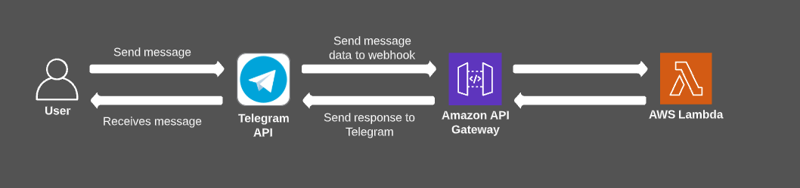

# xteam-tgl-br-bot

This is an exploratory telegram [bot](t.me/xteamBRCustomBot) project used by Brazilian [x-team](https://x-team.com/) community.

## Architecture



## Run locally

This project uses serverless-offline plugin to run locally. Before running the project, make sure you have the `.env` file created and filled with your test `BOT_TOKEN`, see [BotFather docs](https://t.me/botfather) .

```sh
yarn      // install dependencies
yarn dev  // run the project locally
```

This project uses the webhooks functionality of the [telegram bot api](https://core.telegram.org/bots/api), so after running the project, you need to call the route `POST` `/dev/setWebhook` to initialize the webhook.

*Important*: The hot reload feature is not working properly with [telegraf](https://www.npmjs.com/package/telegraf). To see your code changes working you need to restart the server and call `POST` `/dev/setWebhook` again. `¯\_(ツ)_/¯`
